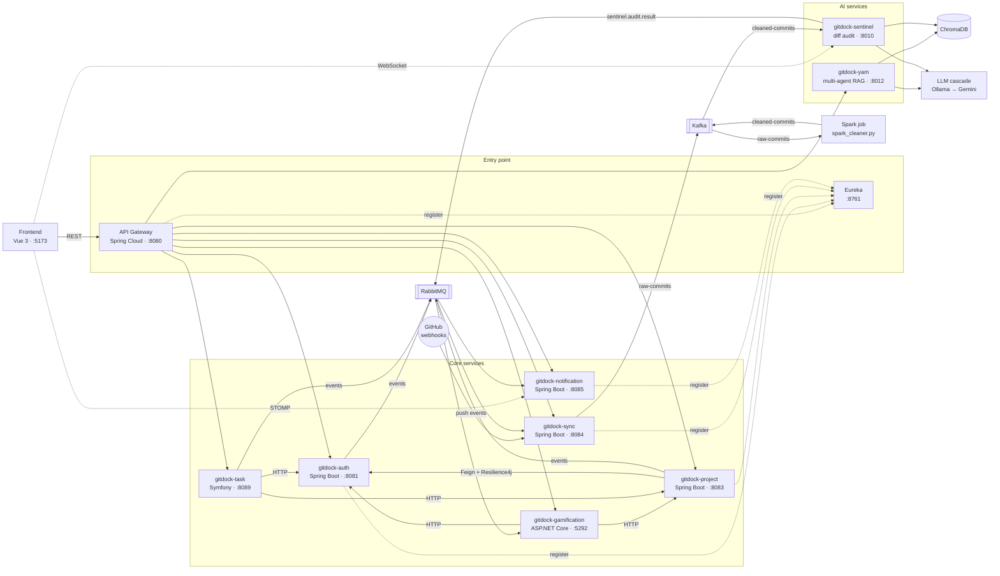

# GitDock Platform

A multi-tenant SaaS platform that centralises and analyses Git contributions,
built as polyglot microservices with an applied-AI layer: a multi-agent RAG
assistant and a real-time security audit of commit diffs.

[](https://github.com/NABIHAyman/gitdock-platform/actions/workflows/java.yml)
[](https://github.com/NABIHAyman/gitdock-platform/actions/workflows/python.yml)
[](https://github.com/NABIHAyman/gitdock-platform/actions/workflows/dotnet.yml)
[](https://github.com/NABIHAyman/gitdock-platform/actions/workflows/php.yml)
[](https://github.com/NABIHAyman/gitdock-platform/actions/workflows/frontend.yml)
[](https://github.com/NABIHAyman/gitdock-platform/actions/workflows/containers.yml)
[](https://github.com/NABIHAyman/gitdock-platform/actions/workflows/security.yml)
[](https://github.com/NABIHAyman/gitdock-platform/actions/workflows/codeql.yml)

> **Academic project.** GitDock was built as a fourth-year engineering project
> at EHEIM Oujda (2025–2026). It has never been deployed to production.
> See [Status and known limitations](#status-and-known-limitations).

**Contents** — [Overview](#overview) · [Tech stack](#tech-stack) ·
[AI and machine learning](#ai-and-machine-learning) · [Architecture](#architecture) ·
[Features](#features) · [Deployment](#deployment) · [CI/CD](#cicd) ·
[Project structure](#project-structure) · [Status](#status-and-known-limitations) ·
[Team](#team-and-contributions) · [Wiki](https://github.com/NABIHAyman/gitdock-platform/wiki)

---

## Overview

Development teams spread their work across repositories, and their managers
lose sight of who contributes what. GitDock pulls commits from GitHub in real
time and turns them into something a team can act on:

- **developers** see their own contributions, progress, experience points and badges;
- **managers** follow projects, assign tasks and read team statistics;
- **company administrators** manage their collaborators and projects, isolated per company;
- **super administrators** get a cross-company view.

Two AI services sit on top of that data. **YAM** is a chat assistant that
answers questions about a team and proposes developers for a task.
**Sentinel** audits every incoming commit diff for security issues and streams
its verdicts to the interface as they arrive.

---

## Tech stack

**Backend**


**AI and machine learning**


**Frontend**


**Data and messaging**


**DevOps**


---

## AI and machine learning

Four services apply AI or machine learning, each to a different problem. The
two LLM services, YAM and Sentinel, follow one rule: **the model reads, the
code decides.** The language model extracts, classifies or summarises; its
output is constrained to a typed schema, and routing, persistence and side
effects stay in deterministic code.

| Service | What it does | Stack |
|---|---|---|
| **`gitdock-yam`** | Multi-agent RAG assistant. An LLM router classifies each question into one of three intents (`team_builder`, `analytics`, `general_chat`), validated by a Pydantic schema; the code then hands it to the matching agent. Developer profiles are embedded and searched to recommend people for a task. | FastAPI, Pydantic-AI, SentenceTransformers, ChromaDB, MongoDB (chat history), Ollama → Gemini |
| **`gitdock-sentinel`** | Real-time DevSecOps audit of commit diffs. Consumes cleaned commits from Kafka, has an LLM audit each diff, indexes code chunks in ChromaDB, pushes the verdict to the interface over WebSocket and publishes it to RabbitMQ. | FastAPI, Kafka, Apache Spark (pre-processing), SentenceTransformers, ChromaDB, Ollama → Gemini, WebSocket, RabbitMQ |
| **`gitdock-ai`** | Anomaly detection on contribution data. | FastAPI, scikit-learn (Isolation Forest), pandas, Streamlit |
| **`AI_Alerte`** | Task risk prediction: flags tasks likely to miss their deadline and those due within 48 hours. | XGBoost, scikit-learn, SQLAlchemy, Streamlit |

**LLM cascade.** Both YAM and Sentinel try a local model served by Ollama first
and fall back to Gemini only if it fails. Local-first keeps data on the
machine and costs nothing per call.

---

## Architecture

The frontend talks to a single entry point, the API Gateway, which resolves
most services through Eureka. Synchronous calls between services go through
Feign clients, protected by Resilience4j where a failure must not cascade.
Everything else is asynchronous: **RabbitMQ** carries business events
(accounts, projects, completed tasks, audit results), and **Kafka** carries the
high-volume commit stream that feeds Sentinel.



### Services

| Service | Stack | Port | Role | Storage |
|---|---|---|---|---|
| `gitdock-gateway` | Spring Cloud Gateway | 8080 | Single entry point, JWT check, routing, CORS | — |
| `gitdock-discovery` | Spring Cloud Netflix Eureka | 8761 | Service registry | — |
| `gitdock-auth` | Spring Boot | 8081 | Accounts, JWT, GitHub OAuth, roles, multi-tenancy, invitations | PostgreSQL |
| `gitdock-project` | Spring Boot | 8083 | Projects, collaborators, branches, commits, diffs, KPIs; creation orchestrated as a saga | PostgreSQL, Redis |
| `gitdock-sync` | Spring Boot | 8084 | GitHub webhooks, commit normalisation, fan-out to Kafka and RabbitMQ | — |
| `gitdock-notification` | Spring Boot | 8085 | Transactional e-mails (Thymeleaf), real-time notifications (STOMP) | PostgreSQL |
| `gitdock-task` | Symfony 7.3 | 8089 | Tasks and epics; publishes `TaskCompletedEvent` | MySQL |
| `gitdock-gamification` | ASP.NET Core 9 | 5292 | Experience points, levels, badges, tags, contributor rankings | PostgreSQL, Redis |
| `gitdock-yam` | FastAPI | 8012 | Multi-agent RAG assistant | ChromaDB, MongoDB |
| `gitdock-sentinel` | FastAPI | 8010 | Real-time audit of commit diffs | ChromaDB |
| `gitdock-ai` | FastAPI, Streamlit | 8000 | Anomaly detection | PostgreSQL |
| `AI_Alerte` | Streamlit | — | Task risk dashboard | MySQL (via SQLAlchemy) |
| `frontend/gitdock-frontend` | Vue 3, Vite | 5173 | Web interface | — |

### Commit pipeline

1. GitHub sends a push event to `gitdock-sync`, which normalises the commits.
2. `gitdock-sync` publishes them to the Kafka topic **`raw-commits`**.
3. A Spark Structured Streaming job (`gitdock-sentinel/scripts/spark_cleaner.py`)
   filters and reshapes them into the topic **`cleaned-commits`**.
4. `gitdock-sentinel` consumes `cleaned-commits`, audits each diff through the
   LLM cascade and indexes code chunks in ChromaDB.
5. Each verdict is pushed live to the interface over WebSocket and published
   to RabbitMQ with the routing key `sentinel.audit.result`.

---

## Features

**Accounts and access** — registration with e-mail activation, sign-in with
JWT, GitHub OAuth, password reset, collaborator invitations. Eight roles,
from developer and tester to company administrator and super administrator;
data is isolated per company.

**Projects** — creation with a team in one step, run as a saga with
compensation if a step fails. Browsing of branches, commits and commit
diffs, collaborators and project KPIs.

**Synchronisation** — GitHub push webhooks feed the platform in real time.
Both the sync service and the OAuth flow are built around a strategy
interface; **GitHub is the only platform implemented**.

**Tasks** — tasks and epics with priorities and statuses. Completing a task
emits an event that the gamification service turns into experience points.
*Smart Close* — closing a task directly from a commit message — has been
implemented but is not yet merged into this repository.

**Gamification** — experience points, levels, badges and tags, configurable
experience rules, contributor rankings per project.

**Notifications** — activation, invitation and password-reset e-mails;
in-app notifications pushed over STOMP WebSocket.

**Interface** — role-specific dashboards, project explorer with side-by-side
diffs (diff2html), task board, gamification dashboards, and a **3D commit
radar** (Three.js) that displays Sentinel verdicts as they arrive.

---

## Deployment

GitDock runs on Docker Compose, split into two stacks: the **main stack**
(infrastructure and application services) and the **Sentinel stack** (Kafka and
the commit-audit pipeline). The steps below bring both up on one machine.

> These steps follow the Compose files and the team's development runbook
> ([`gitdock-commands.txt`](gitdock-commands.txt)). They have **not** been
> replayed end to end for this publication.

### 1. Prerequisites

| Tool | Version |
|---|---|
| Docker Engine and Docker Compose | Compose v2 (`docker compose`) |
| JDK | 17 or later. The code targets Java 17; CI builds with Temurin 21 |
| Maven | None to install: the Maven Wrapper downloads Maven 3.9.16 |
| Python | 3.11, only to run the Spark job and the Python services outside Docker |
| Node.js | 22, for the frontend |
| .NET SDK / PHP | .NET 9 and PHP 8.3 with Composer 2, only to work on those services outside Docker |

The full stack is heavy — three databases, two message brokers, two vector
stores, Ollama and twelve services — so give Docker a generous memory limit.

### 2. Get the code

```bash
git clone https://github.com/NABIHAyman/gitdock-platform.git
cd gitdock-platform/backend/gitdock-backend
```

### 3. Create the environment files

Every value that differs between environments lives in an environment file
that is **never committed**. Each one has a committed template next to it
(`.env.example`): copy it, then fill in the values. Non-sensitive values come
pre-filled; every password, key and token is left empty. The variables are
listed in [Environment variables](#environment-variables).

```bash
# Main stack
cp infrastructure/.env.example infrastructure/.env
for s in auth gateway notification project sync; do
  cp gitdock-$s/.env.example gitdock-$s/.env.local
done
cp gitdock-yam/.env.docker.example gitdock-yam/.env          # Docker hostnames
cp gitdock-gamification/backend/backend/.env.example gitdock-gamification/backend/backend/.env
cp gitdock-sentinel/.env.example gitdock-sentinel/.env

# Standalone AI services (not part of the Compose stacks)
cp gitdock-ai/.env.example gitdock-ai/.env
cp AI_Alerte/.env.example AI_Alerte/.env
```

`gitdock-task/.env.docker` is itself a committed template with neutral values
(`!ChangeMe!`): replace them before any real use. `gitdock-yam` has a second
template, `.env.example`, with `localhost` values for running it outside Docker.

A few values must be consistent across files:

- `JWT_SECRET` must be **identical** in `gitdock-auth`, `gitdock-gateway`,
  `gitdock-project` and `gitdock-gamification`, and at least 32 characters long;
- the PostgreSQL password in `infrastructure/.env` (`POSTGRES_PASSWORD`) is the
  one to use in the services' `DB_PASSWORD` and in the gamification connection
  string;
- `MYSQL_ROOT_PASSWORD` in `infrastructure/.env` must match the password in
  `DATABASE_URL` of `gitdock-task/.env.docker`.

The Compose file refuses to start if a password variable is missing, and says
which one.

### 4. Build the Spring Boot jars

The Java Dockerfiles copy `target/*.jar`, so the jars must exist before the
images are built.

```bash
./mvnw --batch-mode package -DskipTests
```

### 5. Start the main stack

```bash
docker compose -f infrastructure/docker-compose.yml up -d --build
docker compose -f infrastructure/docker-compose.yml ps
```

The first start pulls every base image and builds twelve services; expect it to
take a while.

### 6. Start the Sentinel stack and the Spark job

```bash
docker compose -f gitdock-sentinel/docker-compose.yml up -d
python gitdock-sentinel/scripts/spark_cleaner.py
```

The Sentinel Compose file reads `KAFKA_ADVERTISED_HOST` from
`gitdock-sentinel/.env`: the address Kafka announces to its clients. On a single
machine, `localhost` works; across machines, use an address both `gitdock-sync`
and `gitdock-sentinel` can reach.

The Spark job reads `raw-commits` and writes `cleaned-commits`; without it,
Sentinel receives nothing. It needs `pyspark` and a Java runtime, and expects
Kafka on `127.0.0.1:9092`.

### 7. Start the frontend

```bash
cd ../../frontend/gitdock-frontend
npm ci
npm run dev
```

### 8. Check that everything is up

| What | URL |
|---|---|
| Interface | <http://localhost:5173> |
| API Gateway | <http://localhost:8080/api> |
| Eureka dashboard (registered services) | <http://localhost:8761> |
| RabbitMQ management | <http://localhost:15672> |
| Kafka UI | <http://localhost:8090> |
| `gitdock-auth` health | <http://localhost:8081/actuator/health> |
| `gitdock-notification` health | <http://localhost:8085/actuator/health> |
| `gitdock-yam` health / API docs | <http://localhost:8012/api/yam/ping> · <http://localhost:8012/docs> |
| `gitdock-sentinel` health / API docs | <http://localhost:8013/api/sentinel/health> · <http://localhost:8013/docs> |
| `gitdock-ai` health / API docs | <http://localhost:8000/health> · <http://localhost:8000/docs> |
| `gitdock-gamification` API reference | <http://localhost:5292/scalar/v1> (Development environment only) |
| Container logs | <http://localhost:8887> (Dozzle) |

### 9. Logs, stop and reset

```bash
# Follow the logs of one service
docker compose -f infrastructure/docker-compose.yml logs -f gitdock-gateway

# Stop both stacks, keeping the data
docker compose -f infrastructure/docker-compose.yml down
docker compose -f gitdock-sentinel/docker-compose.yml down

# Stop and delete the data volumes — irreversible
docker compose -f infrastructure/docker-compose.yml down -v
```

After changing a Java service, rebuild its jar with `./mvnw package -DskipTests`
before `docker compose up -d --build`.

### Running a service outside Docker

No credential has a default value in the code, and Spring does not read
`.env.local` on its own: export the variables in your shell, or set them in your
IDE run configuration.

### Compose files

| File | Contents |
|---|---|
| `backend/gitdock-backend/infrastructure/docker-compose.yml` | PostgreSQL, MySQL, MongoDB, RabbitMQ, Redis, ChromaDB, Ollama, administration tools and every application service |
| `backend/gitdock-backend/gitdock-sentinel/docker-compose.yml` | Kafka, Kafka UI and a dedicated ChromaDB for Sentinel |

The development setup ran these two stacks on two machines joined by a private
network. Some defaults still refer to them as `windows-host` (main stack) and
`ubuntu-host` (Sentinel stack, GPU for Ollama); the environment files override
them, and their templates use `localhost` or the Docker service names.

There is no reverse proxy or systemd configuration in the repository: the API
Gateway is the single HTTP entry point, and a production setup would put a
TLS-terminating proxy in front of it.

### Ports

| Component | Port | | Component | Port |
|---|---|---|---|---|
| Frontend (dev) | 5173 | | PostgreSQL | 5432 |
| API Gateway | 8080 | | MySQL | 3306 |
| Eureka | 8761 | | MongoDB | 27017 |
| gitdock-auth | 8081 | | RabbitMQ (AMQP / UI) | 5672 / 15672 |
| gitdock-project | 8083 | | Redis | 6379 |
| gitdock-sync | 8084 | | ChromaDB (YAM) | 8010 |
| gitdock-notification | 8085 | | ChromaDB (Sentinel) | 8005 |
| gitdock-task | 8089 | | Kafka / Kafka UI | 9092 / 8090 |
| gitdock-gamification | 5292 | | Ollama | 11434 |
| gitdock-yam | 8012 | | pgAdmin / phpMyAdmin / Mongo Express | 5050 / 8088 / 8086 |
| gitdock-sentinel | 8013 (Compose) | | Dozzle (logs) | 8887 |
| gitdock-ai | 8000 | | | |

### Environment variables

Listed without values. Each service reads them from the file shown; every file
has a committed `.env.example` template beside it.

| File | Variables |
|---|---|
| `infrastructure/.env` | `POSTGRES_USER`, `POSTGRES_PASSWORD`, `MYSQL_ROOT_PASSWORD`, `MONGO_ROOT_USERNAME`, `MONGO_ROOT_PASSWORD`, `PGADMIN_EMAIL`, `PGADMIN_PASSWORD` |
| `gitdock-auth/.env.local` | `GITHUB_CLIENT_ID`, `GITHUB_CLIENT_SECRET`, `GITHUB_REDIRECT_URI`, `DB_HOST`, `DB_PORT`, `DB_NAME`, `DB_USERNAME`, `DB_PASSWORD`, `JPA_DDL_AUTO`, `JPA_SHOW_SQL`, `SQL_INIT_MODE`, `MAIL_HOST`, `MAIL_PORT`, `MAIL_USERNAME`, `MAIL_PASSWORD`, `RABBITMQ_HOST`, `RABBITMQ_PORT`, `RABBITMQ_USERNAME`, `RABBITMQ_PASSWORD`, `EUREKA_DEFAULT_ZONE`, `JWT_SECRET`, `JWT_EXPIRATION`, `JWT_REFRESH_EXPIRATION`, `ACTIVATION_TOKEN_EXPIRATION`, `FRONTEND_URL`, `LOG_SECURITY` |
| `gitdock-gateway/.env.local` | `FRONTEND_URL`, `EUREKA_DEFAULT_ZONE`, `NOTIFICATION_SERVICE_URL`, `TASK_SERVICE_URL`, `GAMIFICATION_SERVICE_URL`, `YAM_SERVICE_URL`, `JWT_SECRET` |
| `gitdock-project/.env.local` | `DB_HOST`, `DB_PORT`, `DB_NAME`, `DB_USERNAME`, `DB_PASSWORD`, `JPA_DDL_AUTO`, `JPA_SHOW_SQL`, `SQL_INIT_MODE`, `RABBITMQ_HOST`, `RABBITMQ_PORT`, `RABBITMQ_USERNAME`, `RABBITMQ_PASSWORD`, `EUREKA_DEFAULT_ZONE`, `JWT_SECRET` |
| `gitdock-notification/.env.local` | `DB_HOST`, `DB_PORT`, `DB_NAME`, `DB_USERNAME`, `DB_PASSWORD`, `RABBITMQ_HOST`, `RABBITMQ_PORT`, `RABBITMQ_USERNAME`, `RABBITMQ_PASSWORD`, `MAIL_HOST`, `MAIL_PORT`, `MAIL_USERNAME`, `MAIL_PASSWORD`, `EUREKA_DEFAULT_ZONE`, `FRONTEND_URL`, `JPA_DDL_AUTO`, `JPA_SHOW_SQL` |
| `gitdock-sync/.env.local` | `RABBITMQ_HOST`, `RABBITMQ_PORT`, `RABBITMQ_USERNAME`, `RABBITMQ_PASSWORD`, `EUREKA_DEFAULT_ZONE`, `KAFKA_HOST`, `KAFKA_PORT` |
| `gitdock-gamification/backend/backend/.env` | `ConnectionStrings__DefaultConnection`, `ConnectionStrings__Redis`, `RabbitMQ__HostName`, `RabbitMQ__UserName`, `RabbitMQ__Password`, `Services__AuthServiceUrl`, `Services__ProjectServiceUrl`, `Eureka__Client__ServiceUrl`, `Eureka__Instance__HostName`, `JWT_SECRET` |
| `gitdock-task/.env.docker` | `APP_ENV`, `APP_DEBUG`, `APP_SECRET`, `DATABASE_URL`, `MESSENGER_TRANSPORT_DSN`, `AUTH_SERVICE_URL`, `PROJECT_SERVICE_URL`, `MAILER_DSN`, `JWT_SECRET_KEY`, `JWT_PUBLIC_KEY`, `JWT_PASSPHRASE` |
| `gitdock-yam/.env` | `APP_NAME`, `APP_PORT`, `EUREKA_SERVER_URL`, `CHROMA_HOST`, `CHROMA_PORT`, `DEFAULT_LLM_PROVIDER`, `GEMINI_API_KEY`, `GEMINI_MODEL`, `OLLAMA_API_URL`, `OLLAMA_MODEL`, `EMBEDDING_MODEL`, `DRY_RUN` |
| `gitdock-sentinel/.env` | `APP_NAME`, `APP_PORT`, `EUREKA_SERVER_URL`, `CHROMA_HOST`, `CHROMA_PORT`, `KAFKA_HOST`, `KAFKA_PORT`, `KAFKA_ADVERTISED_HOST`, `RABBITMQ_HOST`, `RABBITMQ_PORT`, `RABBITMQ_USER`, `RABBITMQ_PASSWORD`, `OLLAMA_API_URL`, `OLLAMA_MODEL`, `GEMINI_API_KEY`, `GEMINI_MODEL`, `EMBEDDING_MODEL`, `DRY_RUN`, `GITHUB_TOKEN` (scripts) |
| `gitdock-ai/.env` | `DB_HOST`, `DB_PORT`, `DB_NAME`, `DB_USER`, `DB_PASSWORD`, `GITHUB_TOKEN`, `GITLAB_TOKEN` |
| `AI_Alerte/.env` | `DB_HOST`, `DB_PORT`, `DB_NAME`, `DB_USER`, `DB_PASSWORD` |

### Container images

On every version tag (`v*`), CI builds the application images for `amd64` and
`arm64` and publishes them to GitHub Container Registry
(`ghcr.io/nabihayman/<service>`) with an SBOM and build provenance.

---

## CI/CD

GitHub Actions, one workflow per ecosystem. Path filters rebuild only the
services a change touches.

| Workflow | What it does |
|---|---|
| **Java services** | `mvn verify` per changed service, with PostgreSQL and RabbitMQ service containers for the integration tests; JaCoCo coverage report |
| **Python services** | Ruff (blocking on syntax errors and undefined names, advisory on the full rule set and formatting); pytest where a test suite exists |
| **.NET service** | Restore, build and test |
| **PHP service** | `composer validate`, install, PHPStan (advisory), PHPUnit |
| **Frontend** | `npm ci` and production build |
| **Container images** | Build and Trivy scan of each changed image; multi-platform publication to GHCR on tags |
| **Security** | Gitleaks on the full history (blocking), Trivy on dependencies and IaC |
| **CodeQL** | Static analysis of Java, Python, C# and JavaScript/TypeScript |

Every action is pinned to a full commit SHA. Workflows run with read-only
permissions by default, and each job is granted only what it needs.
Dependabot keeps actions, dependencies and base images up to date, with a
seven-day cooldown on new releases.

---

## Project structure

```
gitdock-platform/
├── .github/
│   ├── workflows/            # CI/CD, one workflow per ecosystem + security
│   ├── scripts/              # Image build settings used by the workflows
│   └── dependabot.yml
├── backend/gitdock-backend/
│   ├── pom.xml               # Maven parent of the six Spring Boot services
│   ├── mvnw, .mvn/           # Maven Wrapper
│   ├── gitdock-discovery/    # Eureka server
│   ├── gitdock-gateway/      # API Gateway
│   ├── gitdock-auth/         # Accounts, JWT, OAuth, roles
│   ├── gitdock-project/      # Projects, saga, KPIs
│   ├── gitdock-sync/         # GitHub webhooks → Kafka / RabbitMQ
│   ├── gitdock-notification/ # E-mails, STOMP notifications
│   ├── gitdock-task/         # Symfony task service (+ infra/ for its images)
│   ├── gitdock-gamification/ # ASP.NET Core gamification service
│   ├── gitdock-yam/          # Multi-agent RAG assistant
│   ├── gitdock-sentinel/     # Commit diff audit, Spark job, Kafka stack
│   ├── gitdock-ai/           # Anomaly detection
│   ├── AI_Alerte/            # Task risk dashboard
│   └── infrastructure/       # Main docker-compose.yml and .env.example
├── frontend/gitdock-frontend/  # Vue 3 interface
├── Architecture.md           # Inter-service contracts and event flows
├── gitdock-commands.txt      # Development runbook
└── gitdock-dev-intelligence.txt  # Configuration map of the dev setup
```

---

## Status and known limitations

GitDock is an **academic project**, built by a team of four in 2025–2026 and
**never deployed to production**. This repository assembles the team's work
from its original branches into a single `main`; the full commit history of
every contributor is preserved.

What to expect:

- **Not replayed end to end here.** The setup steps come from the team's
  development environment; they were not re-run for this publication.
- **Known integration issues.** For example, the gamification service listens
  for commit events under routing keys that no service publishes, so experience
  points come from completed tasks only. The
  [wiki](https://github.com/NABIHAyman/gitdock-platform/wiki/Architecture#known-integration-issues)
  and [`gitdock-dev-intelligence.txt`](gitdock-dev-intelligence.txt) list the others.
- **Only GitHub is supported** for synchronisation and OAuth.
- **Smart Close pending.** The commit-driven task closing is implemented but
  not yet merged here; its integration test is already in
  `gitdock-task/backend/tests/`.
- **Spark job run by hand.** The pre-processing job in front of Sentinel is a
  standalone script, not yet packaged as a service.
- **Dependency updates pending.** The Spring Boot 3.3 dependency set carries
  known, already-fixed vulnerabilities. Trivy reports them in the Security tab,
  and Dependabot proposes the updates.
- **Linting not yet enforced.** Python formatting and PHPStan are advisory
  until the codebase has been through a clean-up pass.

---

## Team and contributions

| Contributor | Scope |
|---|---|
| **Ayman NABIH** | Architecture, backend & AI (platform design, authentication, projects, synchronization, notifications, and the AI services) |
| **Maryam LOUKILI** | `gitdock-task`, `gitdock-ai-alert` (`AI_Alerte`) |
| **Rihab ADDOU** | `gitdock-gamification`, `gitdock-ai` |
| **Amal SADKI** | Integration tests (Testcontainers) |

---

## Author

**Ayman NABIH**
[github.com/NABIHAyman](https://github.com/NABIHAyman) ·
[linkedin.com/in/nabihayman](https://linkedin.com/in/nabihayman) ·
[nabih.ayman.ai@gmail.com](mailto:nabih.ayman.ai@gmail.com)
